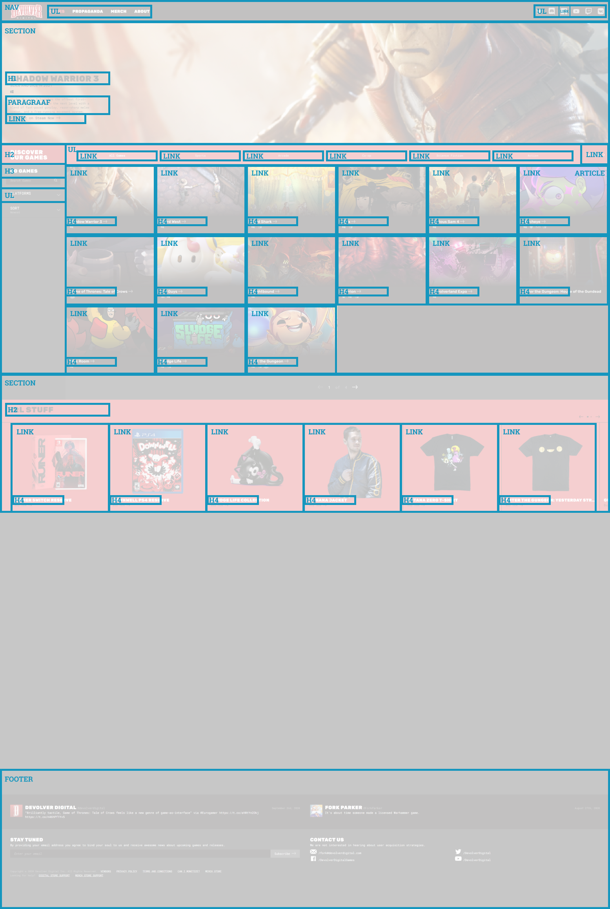

# Procesverslag
**Auteur:** Mauro Stuifzand
**Auteur:** -jouw naam-

Markdown cheat cheet: [Hulp bij het schrijven van Markdown](https://github.com/adam-p/markdown-here/wiki/Markdown-Cheatsheet). Nb. de standaardstructuur en de spartaanse opmaak zijn helemaal prima. Het gaat om de inhoud van je procesverslag. Besteedt de tijd voor pracht en praal aan je website.

## Bronnenlijst
1. https://developer.mozilla.org/en-US/
1. -bron 1-
2. -bron 2-
3. -...-

@@ -30,41 +30,20 @@ Markdown cheat cheet: [Hulp bij het schrijven van Markdown](https://github.com/a

## Voortgang 2 (week 5)

### Stand van zaken

De basis van de website verliep soepel en en nog niet echt tegen een groot probleem aangelopen. Moet nog even kijken naar de juiste font weights voor de header. 

Ik liep vooral tegen het balanceren van de tijd aan met werk, school en dan ook de verschillende vakken.

**Screenshot(s):**

-screenshot(s) van hoe ver je bent-

### Agenda voor meeting
-same as voortgang 1-

-samen met je groepje opstellen-

### Verslag van meeting

-na afloop snel uitkomsten vastleggen-

## Voortgang 1 (week 3)

### Stand van zaken

De basis van de website verliep soepel en en nog niet echt tegen een groot probleem aangelopen. Moet nog even kijken naar de juiste font weights voor de header. 

Ik liep vooral tegen het balanceren van de tijd aan met werk, school en dan ook de verschillende vakken.
-dit ging goed & dit was lastig-

**Screenshot(s):**

-screenshot(s) van hoe ver je bent-

### Agenda voor meeting

-samen met je groepje opstellen-
@@ -77,18 +56,16 @@ Ik liep vooral tegen het balanceren van de tijd aan met werk, school en dan ook

## Intake (week 1)

**Je startniveau:** Rood
**Je startniveau:** -kies uit zwart, rood óf blauw-

**Je focus:** Surface
**Je focus:** -kies uit responsive óf surface plane-

**Je opdracht:** https://www.devolverdigital.com/
**Je opdracht:** -link naar de website die je gaat namaken óf de naam van je eigen ontwerp-

**Screenshot(s):**

**Breakdown-schets(en):**

